# Pipeline `office-auto` — Luồng & I/O từng tool

> Bản phác họa luồng xử lý của 18 file trong [`tools/`](../tools). Mỗi block trong flowchart
> đã nhúng sẵn **NHẬN gì → LÀM gì → RA gì**. Các sơ đồ vẽ bằng Mermaid (VSCode / GitHub render trực tiếp).
>
> Kiến trúc: **compiler DOCX 3 tầng** — `Semantic → Logical → Physical`.
> Chỉ tầng Semantic được phép phi xác định (LLM/n-gram); hai tầng còn lại 100% deterministic.

---

## 0. Phân loại 18 file

| Vai trò | File | CLI? |
|---|---|---|
| **Đọc nội dung** | `markdown-parser.py` | ✅ |
| **Đọc template** | `template_inspector.py` | ✅ |
| **Profile / hợp đồng** | `contracts.py`, `profile_synth.py` | ✅ |
| **Tầng Semantic** | `semantic_classifier.py` | ✅ |
| **Tầng Logical** | `logical_mapper.py` | ✅ |
| **Tầng Physical (plan)** | `planner.py` | ✅ |
| **Kiểm tra trước build** | `plan_validator.py` | ✅ |
| **Compose** | `doc_composer.py` | ✅ |
| **Kiểm tra sau build** | `validator.py` | ✅ |
| **Perception (cho LLM)** | `report_view.py` | ✅ |
| **Thư viện (import, không chạy độc lập)** | `inline.py`, `block_specs.py`, `template_ir.py`, `role_matcher.py`, `capabilities.py`, `slots.py`, `validation_checks.py` | — |

---

## 1. Sơ đồ tổng — toàn bộ pipeline

```mermaid
flowchart TB
    %% ───────── INPUTS ─────────
    MD["📄 noidung.md<br/><i>nguồn nội dung (markdown)</i>"]
    TPL["📄 template.docx<br/><i>khuôn định dạng</i>"]
    PROF["📄 profiles/&lt;id&gt;.json<br/><i>vocab role + keyword + placement</i>"]

    %% ───────── CONTENT BRANCH ─────────
    subgraph CONTENT["NHÁNH NỘI DUNG"]
        MDP["⚙️ markdown-parser.py<br/>━━━━━━━━━━<br/>NHẬN: noidung.md<br/>LÀM: tách section theo #/##/###;<br/>parse body→blocks (block_specs);<br/>tokenize inline (inline.py);<br/>dựng document_tree + đếm para<br/>RA: <b>content.ir.json</b><br/>{sections[], document_tree,<br/>body_blocks, para_metadata}"]
    end

    %% ───────── TEMPLATE BRANCH ─────────
    subgraph TEMPLATE["NHÁNH TEMPLATE"]
        TI["⚙️ template_inspector.py<br/>━━━━━━━━━━<br/>NHẬN: template.docx<br/>LÀM: officecli query/view;<br/>chọn best_prototype mỗi style;<br/>khám phá body_style/format/tables;<br/>gán CONTENT vs FRONT (cấu trúc)<br/>RA: <b>template.ir.json</b><br/>{best_prototypes, body_sequence,<br/>body_format, body_tables}"]
    end

    %% ───────── PROFILE RESOLVE ─────────
    subgraph PROFILEZONE["PROFILE & HỢP ĐỒNG"]
        SYNTH["⚙️ profile_synth.py (tùy chọn)<br/>━━━━━━━━━━<br/>NHẬN: content.ir + template.ir + --id<br/>LÀM: dò genre theo _SIGNALS;<br/>quyết front_matter_strategy;<br/>suy capabilities<br/>RA: profiles/&lt;id&gt;.json (extends _base)"]
        CONTRACTS["⚙️ contracts.resolve_profile()<br/>━━━━━━━━━━<br/>NHẬN: profiles/&lt;id&gt;.json<br/>LÀM: theo chuỗi extends, merge overlay,<br/>strip key '//', validate schema<br/>RA: profile đã resolve (dict)"]
    end

    %% ───────── SEMANTIC TIER ─────────
    SEM["⚙️ semantic_classifier.py  <b>(TẦNG SEMANTIC — phi xác định)</b><br/>━━━━━━━━━━<br/>NHẬN: content.ir + profile<br/>LÀM: gán semantic_role mỗi node<br/>(keyword 0.9 → n-gram cosine via role_matcher → lazy first_paragraph);<br/>clamp role lạ về default; quality_gate<br/>RA: <b>semantic.ir.json</b> {nodes[].(node_id, semantic_role, confidence, evidence)}"]

    %% ───────── LOGICAL TIER ─────────
    LOG["⚙️ logical_mapper.py  <b>(TẦNG LOGICAL — xác định)</b><br/>━━━━━━━━━━<br/>NHẬN: semantic.ir + content.ir + profile<br/>LÀM: role→role_to_logical (intent/section/toc);<br/>confidence-gate preserve (τ=0.85);<br/>tính outline_shift; negotiate capabilities<br/>RA: <b>logical.ir.json</b> {sections[].(intent, presentation, outline_level, toc), outline_shift, front_matter_strategy}"]

    %% ───────── PHYSICAL TIER ─────────
    PLAN["⚙️ planner.py  <b>(TẦNG PHYSICAL — xác định)</b><br/>━━━━━━━━━━<br/>NHẬN: logical.ir + content.ir + template.ir<br/>LÀM: slots.classify (slot vs furniture);<br/>emit remove slot; add heading+body (block_specs);<br/>move trailing furniture trước sectPr<br/>RA: <b>batch_program.json</b> {remove/add/move ops}"]

    PV["⚙️ plan_validator.py  <i>(GATE trước build)</i><br/>━━━━━━━━━━<br/>NHẬN: batch_program + template.ir + content.ir<br/>LÀM: remove-target tồn tại? add-p có style?<br/>run không rỗng? đếm para khớp content?<br/>RA: pass/fail (exit 1 nếu lỗi)"]

    COMP["⚙️ doc_composer.py<br/>━━━━━━━━━━<br/>NHẬN: template.docx + batch_program.json<br/>LÀM: copy→tmp; tách remove/add thành 2 batch cycle;<br/>preflight equation (degrade→text nếu KaTeX fail);<br/>officecli batch; atomic rename<br/>RA: <b>report.docx</b> + summary JSON"]

    %% ───────── POST-CHECK ─────────
    subgraph POST["KIỂM TRA SAU BUILD"]
        VAL["⚙️ validator.py (S1–S9)<br/>━━━━━━━━━━<br/>NHẬN: report.docx + template.ir + content.ir + logical.ir<br/>LÀM: đọc lại docx, chạy 9 S-check<br/>(schema, font/size, indent, line-spacing,<br/>completeness, heading count, furniture sống sót)<br/>RA: CheckResult[] (exit 1 nếu error)"]
        RV["⚙️ report_view.py (perception, KHÔNG pass/fail)<br/>━━━━━━━━━━<br/>NHẬN: report.docx + content.ir<br/>LÀM: view text theo reading-order;<br/>dò foreign-text / lệch table / heading lạ<br/>RA: view nén + observations cho LLM"]
    end

    OUT["✅ report.docx"]

    %% ───────── EDGES ─────────
    MD --> MDP
    TPL --> TI
    MDP -- content.ir.json --> SEM
    MDP -. content.ir .-> SYNTH
    TI -. template.ir .-> SYNTH
    TI -- template.ir.json --> PLAN
    PROF --> CONTRACTS
    SYNTH -. sinh nếu thiếu profile .-> CONTRACTS
    CONTRACTS -- profile (resolved) --> SEM
    CONTRACTS -- profile --> LOG
    SEM -- semantic.ir.json --> LOG
    MDP -- content.ir.json --> LOG
    LOG -- logical.ir.json --> PLAN
    MDP -- content.ir.json --> PLAN
    PLAN -- batch_program.json --> PV
    PV -- OK --> COMP
    TPL --> COMP
    COMP -- report.docx --> VAL
    COMP -- report.docx --> RV
    MDP -. content.ir .-> VAL
    TI -. template.ir .-> VAL
    LOG -. logical.ir .-> VAL
    VAL --> OUT
    RV -. phản hồi LLM .-> SEM

    classDef input fill:#e8f0fe,stroke:#4285f4,color:#111
    classDef sem fill:#fff4e5,stroke:#f59e0b,color:#111
    classDef det fill:#e6f4ea,stroke:#34a853,color:#111
    classDef check fill:#fce8e6,stroke:#ea4335,color:#111
    class MD,TPL,PROF input
    class SEM sem
    class MDP,TI,LOG,PLAN,COMP,CONTRACTS,SYNTH det
    class PV,VAL,RV check
```

**Đường nét đứt** = phụ trợ/tùy chọn (synth profile, perception feedback, IR phụ cho validator).
**Đường nét liền** = dòng dữ liệu chính bắt buộc.

---

## 2. Nhánh nội dung — chi tiết `markdown-parser.py`

Đây là nơi markdown thô biến thành IR có cấu trúc. Vòng lặp block là điểm mấu chốt.

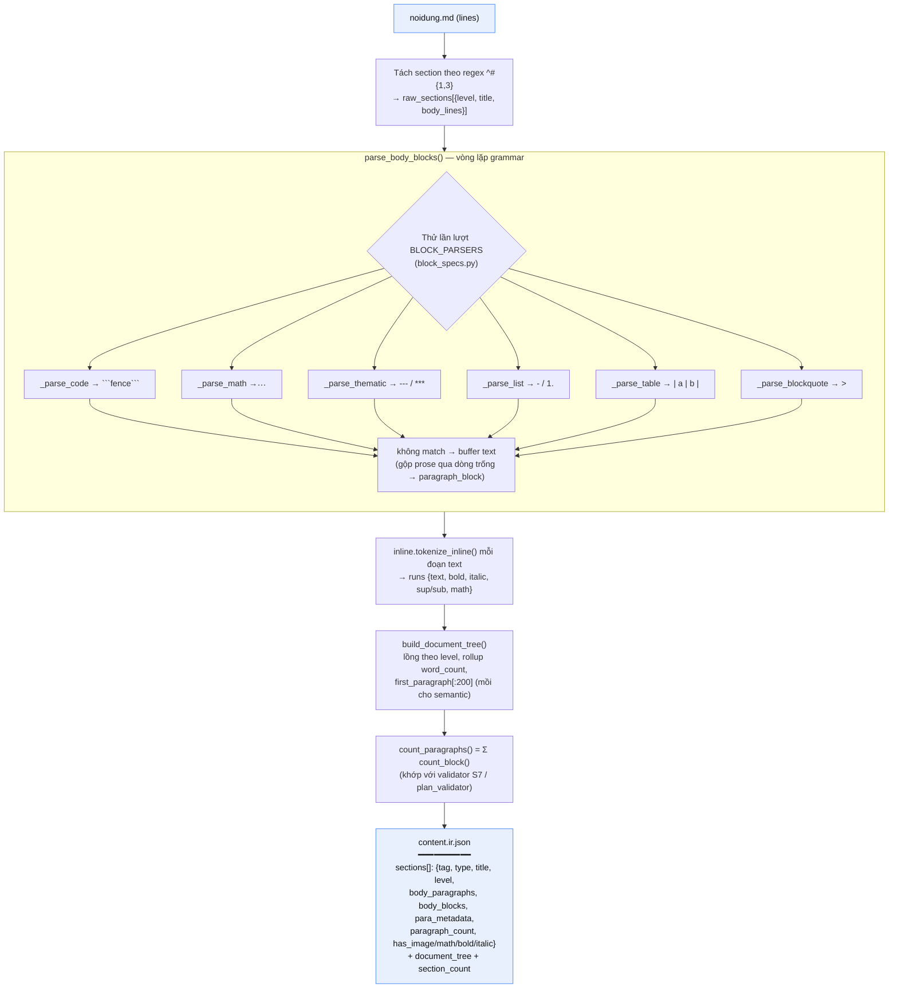

**Module thư viện đi kèm:**

- **`inline.py`** — NHẬN chuỗi inline → bóc link `[..](..)`, carve math `$..$` trước, tokenize emphasis `***/**/*/_`, `<sup>/<sub>` theo thứ tự ưu tiên, gộp run cùng style → RA `list[run]`. (`_` italic có word-boundary để không phá `combined_loss`.)
- **`block_specs.py`** — registry "một BlockSpec cho mỗi loại": gói chung 3 thao tác `parse / emit / count` → đồng bộ giữa reader và writer. Block lạ → degrade thành paragraph (B3 escape hatch). Kèm `normalize_formula()` gỡ `\left/\right` cho KaTeX→OMML.

---

## 3. Nhánh template — chi tiết `template_inspector.py`

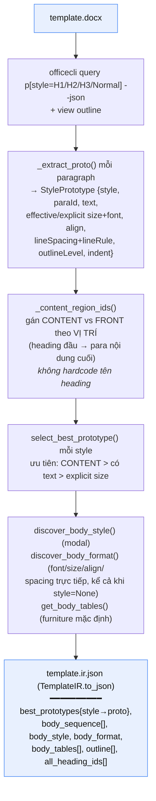

- **`template_ir.py`** — dataclass `StylePrototype` + `TemplateIR`. Quan trọng: `build_props()` ánh xạ giá trị **readback** → **SET-key** officecli (vd `ind.firstLine` → `firstLineIndent`; luôn set cả `font.ascii`+`font.hAnsi`; **luôn kèm `lineRule`** vì officecli mặc định pt-spacing thành `exact` → đè bẹp chữ).

---

## 4. Profile & hợp đồng

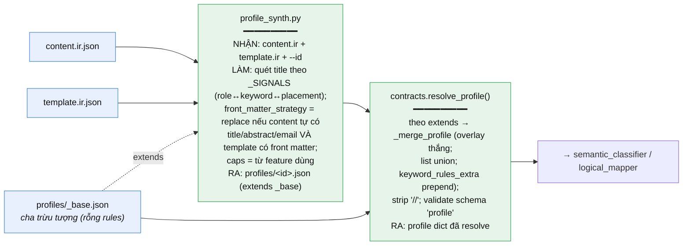

- **`capabilities.py`** (lib) — `detect_features(content_ir)` → tập feature dùng (table/code/equation/math/image/list/callout); `negotiate(features, caps)` → báo feature dùng nhưng template không render được (degrade có chủ đích, không crash, không âm thầm bỏ).

---

## 5. Tầng Semantic — `semantic_classifier.py`

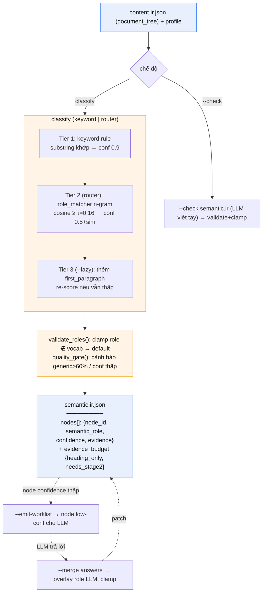

- **`role_matcher.py`** (lib) — dựng vector **char n-gram (3–5, bỏ dấu)** cho mỗi role từ `name + description + keywords`, IDF qua các role; `match(text)` → `(best_role, similarity)`. 100% offline, ngôn ngữ-agnostic (VN/EN), **không bao giờ ra role ngoài vocab** (closed-set).

---

## 6. Tầng Logical — `logical_mapper.py`

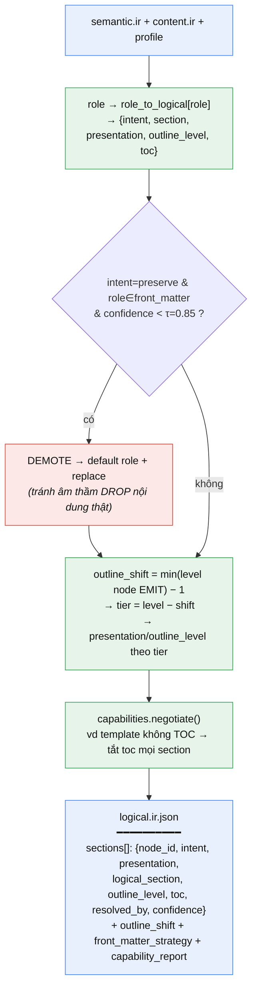

> **outline_shift** xử lý ca: nội dung thật bắt đầu dưới level top (vd mọi thứ nằm dưới 1 chương title được preserve). Heading nông nhất trong các node EMIT trở thành tier 1.

---

## 7. Tầng Physical — `slots.py` + `planner.py`

### 7a. `slots.py` — phân loại SLOT vs FURNITURE (cốt lõi "preserve-by-default")

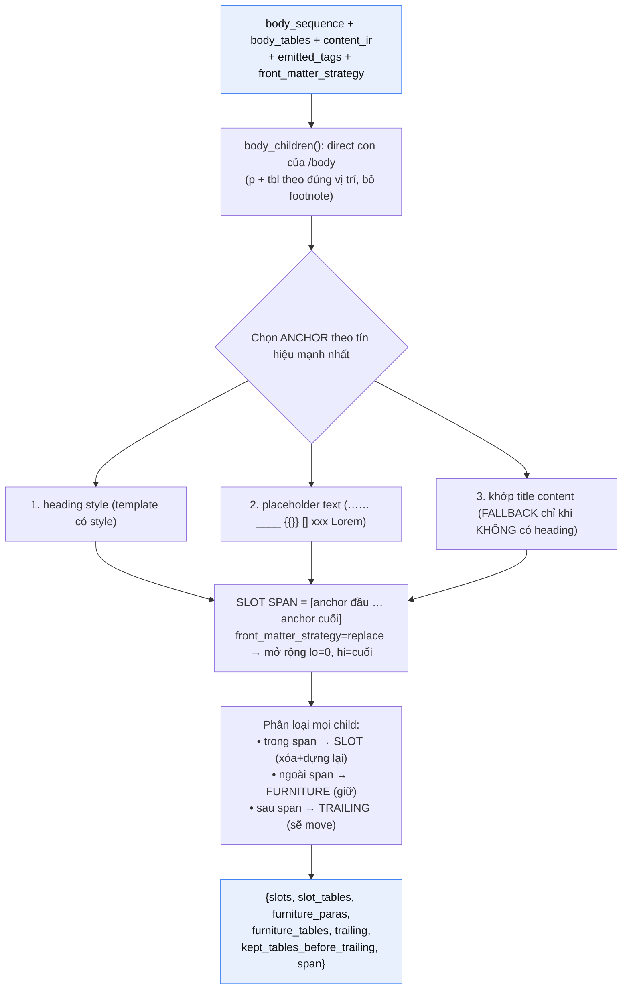

> **Bất biến quan trọng:** `slots.classify()` được **planner và validator S9 dùng chung** với cùng input → hai bên luôn đồng thuận đâu là furniture cần giữ.

### 7b. `planner.py` — dựng batch program

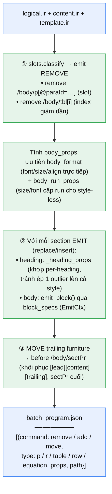

- **`block_specs.py` (emit side)** — `EmitCtx` gói `program + body_props + run_props`. `emit_runs()` đẩy `add r` (bold/italic/sup/sub, mono→Courier, inline math→`add equation`). Mỗi kind có handler riêng: paragraph, callout (indent), list (listStyle), code (mono), table (colWidths + add row + add cell), equation (display/inline).

---

## 8. Gate trước build — `plan_validator.py`

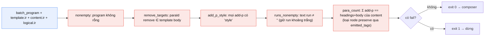

---

## 9. Compose — `doc_composer.py`

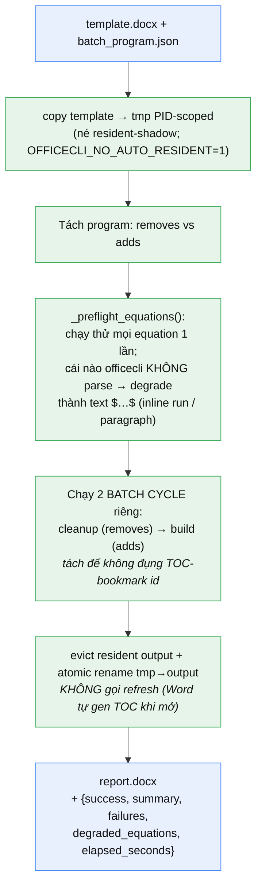

---

## 10. Kiểm tra & perception sau build

### 10a. `validator.py` + `validation_checks.py` — S1→S9

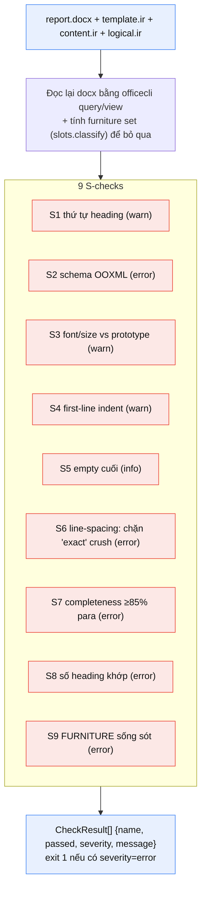

### 10b. `report_view.py` — perception (KHÔNG pass/fail)

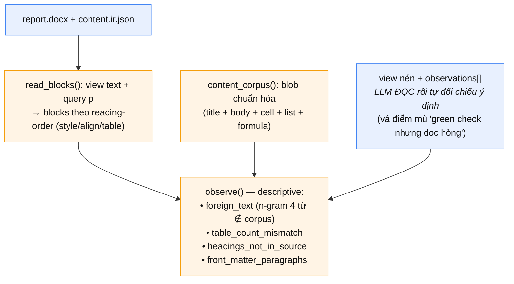

---

## 11. Bảng tổng I/O (tra nhanh)

| Tool | NHẬN | RA |
|---|---|---|
| `markdown-parser.py` | `noidung.md` | `content.ir.json` |
| `template_inspector.py` | `template.docx` | `template.ir.json` |
| `profile_synth.py` | `content.ir` + `template.ir` + id | `profiles/<id>.json` |
| `contracts.py` | profile / IR + schema | profile resolved / validate OK |
| `semantic_classifier.py` | `content.ir` + profile | `semantic.ir.json` |
| `logical_mapper.py` | `semantic.ir` + `content.ir` + profile | `logical.ir.json` |
| `planner.py` | `logical.ir` + `content.ir` + `template.ir` | `batch_program.json` |
| `plan_validator.py` | `batch_program` + `template.ir` + `content.ir` | pass/fail |
| `doc_composer.py` | `template.docx` + `batch_program.json` | `report.docx` |
| `validator.py` | `report.docx` + IRs | CheckResult[] (S1–S9) |
| `report_view.py` | `report.docx` + `content.ir` | view + observations |

**Thư viện:** `inline.py` (text→runs) · `block_specs.py` (parse/emit/count block) · `template_ir.py` (dataclass + build_props) · `role_matcher.py` (n-gram match) · `capabilities.py` (negotiate) · `slots.py` (slot/furniture) · `validation_checks.py` (S-checks).
