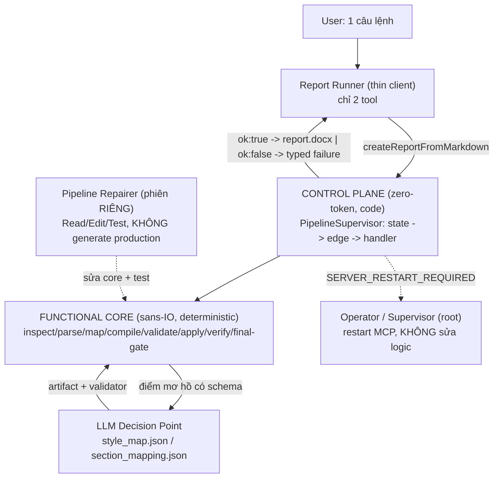

<aside>
🎯

**Tinh túy một câu:** Bạn không thất bại vì chưa fix đủ bug, mà vì **chưa thay đổi *control topology** *— LLM vẫn là* bộ điều khiển cấp cao nhất *và vẫn* cầm đủ công cụ để tự phá flow*. Mọi framework nghiêm túc (Compiled AI, 12-Factor Agents, Conductor, Temporal, Erlang/OTP) đều hội tụ về một động tác: lấy bớt quyền của LLM và đưa control ra khỏi LLM**, chứ không phải làm prompt/model tốt hơn.

</aside>

> **Bối cảnh đọc:** Báo cáo này tổng hợp lại 3 tài liệu bạn đã viết (chẩn đoán 7 issue, plan I1–I6, checklist verify) và đối chiếu với các framework/research thế giới, rồi chắt lọc một **lăng kính thiết kế mới** + **trình tự thoát loop**. Mục tiêu không phải lặp lại plan cũ, mà chỉ ra *tầng bạn chưa chạm tới* và *quyết định kiến trúc bạn buộc phải chọn*.
> 

## 0. TL;DR — đọc 60 giây

<aside>
🔴

**Chẩn đoán tầng sâu**

Bạn fix ở *tầng bug* và *tầng workflow*, nhưng vấn đề nằm ở *tầng control topology* và *tầng triết lý*. Hai tài liệu của bạn đang **mâu thuẫn gốc**: một bên nói "LLM = não, làm *mọi* reasoning kể cả style mapping"; bên kia nói "code owns state, LLM chỉ quyết định bounded". Bạn đang chạy triết lý maximalist trên model local 35B — bất khả thi.

</aside>

<aside>
🟢

**Động tác thoát**

1. Tách **control plane** (định tuyến) ra khỏi LLM — orchestration *zero-token*, deterministic.
2. Đẩy LLM về **compile-time** (thiết kế mapping một lần), không phải **run-time** (chạy mọi phase).
3. **Lấy bớt tool**: report runner chỉ còn 2 tool read-only-ish.
4. Biến "model tệ vẫn không phá được flow" thành **eval đo được**.
</aside>

---

## 1. Vì sao bạn vẫn thất bại dù đã đúng *rất nhiều*

Bạn đã chẩn đoán cực kỳ chính xác ở Báo cáo chẩn đoán 7 issue, Plan I1–I6 và Checklist verify. Vấn đề không phải bạn sai — mà là bạn **đang sửa ở 2 tầng dưới, trong khi gốc nằm ở 2 tầng trên**.

| Tầng | Bạn đã làm gì | Đủ chưa? |
| --- | --- | --- |
| **1. Bug** (parser, schema, normalize) | Recursive parser, Zod BodyMap, canonical heading key… | ✅ Đúng nhưng không đủ |
| **2. Workflow** (durable graph, event log) | createReportFromMarkdown + supervisor + 12 phase + events.jsonl | ✅ Đúng hướng, nhưng… |
| **3. Control topology** (ai là bộ điều khiển?) | ❌ LLM **vẫn** là top-level controller, vẫn cầm Read/Edit/Bash/kill | 🔴 **Chưa chạm** |
| **4. Triết lý** (LLM được phép *suy nghĩ* tới đâu) | ❌ Hai tài liệu mâu thuẫn nhau, chưa ai "phân xử" | 🔴 **Chưa chạm** |

### 1.1. Mâu thuẫn gốc trong chính triết lý của bạn (điểm quan trọng nhất)

Đây là thứ tôi nghĩ đang âm thầm giết mọi nỗ lực của bạn. Hai tài liệu chủ đạo của bạn **chống nhau**:

| Plan I1–I6 — triết lý "scripts=tay, LLM=não" |
| --- |
| "**LLM làm *toàn bộ* reasoning** kể cả heading detection, **style mapping**, template classification". "Raw data only / **zero heuristics**". Cấm script suy luận (cấm `StyleResolver`, cấm `profile_template`). |
| ⚠️ **Không thể đồng thời đúng.** Bạn vừa muốn LLM gánh *mọi* suy luận ngữ nghĩa nặng (trên model local 35B @ 58K context), vừa muốn LLM chỉ quyết định những mẩu nhỏ có schema. Mỗi lần fail, bạn vô thức trượt về phía "để LLM lo" — và đó chính là cái cửa để nó improvise, sửa code, kill server. |

<aside>
🧩

Chính Plan I1–I6 mục 8 đã *linh cảm* điều này: "Triết lý 'LLM làm mọi reasoning kể cả style mapping' đang chạy trên model local 35B chưa đủ ổn định ở context 58K… nếu model vẫn không kham nổi, hãy **chủ động chọn nới triết lý ở đúng MỘT điểm**." → Bạn đã thấy cánh cửa thoát, nhưng chưa bước qua. **Phần 6 dưới đây sẽ ép quyết định này thành dứt khoát.**

</aside>

### 1.2. "Kể cả model mạnh hơn cũng loop" — vì sao bạn đúng (và có số liệu)

Trực giác của bạn được research xác nhận thẳng:

- **Non-determinism tồn tại *ngay cả ở temperature = 0*.** Bài Compiled AI dẫn chứng: accuracy dao động tới **15% giữa các lần chạy** (Atil 2024); output variance **18–75%** do yếu tố kiến trúc như MoE routing (Ouyang 2023). → Bạn *không thể* prompt mình ra khỏi sự bất định này.
- **Multi-turn làm sụp đổ độ tin cậy.** CRMArena-Pro: agent success rate **rớt từ 58% (single-turn) xuống 35% (multi-turn)**. Log của bạn chính là một multi-turn dài → đúng vùng sụp đổ.
- **79% lỗi multi-agent đến từ *specification & coordination*, không phải hạ tầng** (Cemri 2025). → Đúng với chẩn đoán của bạn: đây là **lỗi boundary/contract**, không phải lỗi model.

<aside>
💡

**Hệ quả thiết kế:** Nếu mỗi transaction đều gọi LLM ở vòng điều khiển, bạn *thừa kế* toàn bộ sự bất định đó vào *control flow*. Cách duy nhất để dập là **đưa LLM ra khỏi vòng điều khiển** — để định tuyến do code quyết định (xác suất lỗi = 0), LLM chỉ được gọi ở vài điểm hữu hạn, có validator.

</aside>

---

## 2. Lăng kính thiết kế mới — 5 thấu kính từ thế giới

Đây là phần "góc nhìn mới" bạn yêu cầu. 5 thấu kính dưới đây *độc lập* được phát minh bởi 5 cộng đồng khác nhau, nhưng **hội tụ về cùng một kết luận** — đó là tín hiệu mạnh rằng đây là hướng đúng.

### 🔭 Thấu kính A — Compile-time vs Run-time *(Compiled AI)*

> *"Many enterprise workflows require intelligence to design but not to execute repeatedly. Runtime agent systems conflate these two phases."* — Compiled AI
> 

Đây là **bất đối xứng cốt lõi** mà bạn đang bỏ lỡ. Việc *thiết kế* cách map `noidung.md` → template cần trí tuệ. Việc *thực thi* docx ops thì **không** cần LLM lần nào nữa.

- Compiled AI: LLM bị giới hạn sinh **business-logic function trong template đã validate**, qua **pipeline 4 tầng** (security → syntax → execution test → output accuracy). Sau đó chạy *deterministic, zero LLM*.
- Kết quả: **100% reproducibility, 0 output entropy**, P50 4.5ms (so với 2,004ms), và **attack surface prompt-injection co từ "mỗi transaction" xuống "mỗi loại workflow compile một lần"**.
- **Silent failure** bị biến thành **compile-time failure phát hiện được** — chính là cái bạn cần thay cho "agent đoán rồi sửa code".

<aside>
📌

**Áp cho office-auto:** `createReportFromMarkdown` phải là **runtime deterministic** (không LLM trong vòng). LLM chỉ xuất hiện ở **compile-time của *mapping*** — sinh `style_map.json` / `section_mapping.json` một lần, validate bằng schema, rồi engine chạy thuần code.

</aside>

### 🔭 Thấu kính B — Control plane vs Data plane *(Microsoft Conductor)*

> *"The orchestration layer consumes zero tokens. The structure is fixed at definition time — and that's the point."* — Conductor
> 

Conductor định nghĩa workflow trong YAML, **routing giữa các bước là deterministic** (Jinja2 + expression, "first matching condition wins"), **không có LLM trong vòng điều phối**. Chris Gillum (Microsoft) tóm tắt: *"document generation… determinism > creativity"* — đúng class bài toán của bạn.

<aside>
📌

**Áp cho office-auto:** Cái thought-loop "PHASE_HANDLERS shifted? maybe handler returns wrong nextPhase?" của bạn là bằng chứng LLM đang *làm việc của control plane*. Control plane phải là **code thuần, zero-token**: supervisor đọc state → chọn edge → gọi handler. Handler **không được tự chọn nextPhase**. (Bạn đã viết đúng spec này ở mục 4.4 của báo cáo — giờ nâng nó thành *luật bất biến*.)

</aside>

### 🔭 Thấu kính C — Functional Core / Imperative Shell + Sans-IO

Để cái engine deterministic *thật sự* test được mà không cần LLM/MCP, lõi pipeline phải là **hàm thuần**: input → output, **không IO, không spawn, không đọc env**. Mọi IO (đọc docx, gọi `officecli`, ghi file, spawn) đẩy ra **vỏ mệnh lệnh (imperative shell)** mỏng ngoài cùng. (Wlaschin — Functional Core, Imperative Shell)

Điều này giải quyết trực tiếp một red flag trong log: agent *không cần* server đang chạy để verify một fix — nó chỉ cần chạy **pure-function test của core**. "Vừa sửa code vừa dùng MCP server đang chạy" chỉ xảy ra khi core *không* tách khỏi shell.

<aside>
📌

**Áp cho office-auto:** `office-auto generate --template … --source … --target …` (CLI) gọi thẳng **functional core**, *không* qua LLM, *không* qua MCP. Đây là **ground truth**: nếu CLI fail thì cấm đụng tới agent (đúng như Day 6 trong plan cũ của bạn — nhưng giờ nó là *kiến trúc*, không phải *thứ tự công việc*).

</aside>

### 🔭 Thấu kính D — Supervisor tree / "Let it crash" *(Erlang/OTP)*

> Một **supervisor** chỉ làm: start child, monitor, **restart on failure**. Business logic sống trong **worker**. *"The structural separation is strict."* (Zylos: Supervisor Trees for AI Agents, Adopting Erlang)
> 

Đây là khung lý thuyết cho đúng cái "agent tự `kill -HUP` MCP server" của bạn. Trong OTP, **worker tuyệt đối không tự restart chính nó hay anh em nó** — đó là việc của supervisor ở tầng trên. *"Critical, stable logic near the root; volatile logic at the leaves; a failure at a leaf cannot propagate upward past its supervisor."*

<aside>
📌

**Áp cho office-auto:** Report-runner (worker, leaf) **không bao giờ** được quản lý lifecycle MCP (đó là root/supervisor — chính là OpenCode/VS Code/operator). Khi cần restart, worker chỉ được **crash có cấu trúc**: trả `{ ok:false, error_code:"SERVER_RESTART_REQUIRED", manual_action:"…" }`. "Let it crash" = *fail rõ ràng cho tầng trên xử lý*, **không** = *tự sửa giữa đường*.

</aside>

### 🔭 Thấu kính E — Least Privilege / Agency Scoping *(AWS, 12-Factor)*

AWS Agentic AI Security Scoping Matrix phân **Agency** thành 4 scope. Bài toán của bạn nên ở **Scope 1 (No Agency): human-initiated, fixed workflow path** — *không phải* Scope 4 (full agency). Least-privilege cho agent nghĩa là: *"restrict each agent's tool access… to only what its specific task requires, nothing more"* (Cequence).

Ghép với **12-Factor Agents** — bộ nguyên lý gần như viết riêng cho nỗi đau của bạn:

| Factor | Ý nghĩa cho office-auto |
| --- | --- |
| **#4 — Tools are just structured outputs** | Tool call = JSON có schema, không phải "LLM tự do hành động". |
| **#5 — Unify execution state & business state** | `events.jsonl` là *một* nguồn sự thật; LLM không giữ state trong "thought". |
| **#6 — Launch/Pause/Resume** | Retry/resume từ phase fail, không "start fresh". |
| **#7 — Contact humans with tool calls** | Khi bí → escalate bằng structured action, *không* tự sửa code. |
| **#8 — Own your control flow** | Control flow là code bạn sở hữu, không phải vòng lặp LLM tự do. |
| **#9 — Compact errors into context** | Failure contract gọn, đóng — không đổ raw ENOENT cho LLM đoán. |
| **#10 — Small, focused agents** | Mỗi agent một việc; runner ≠ repairer ≠ operator. |
| **#12 — Stateless reducer** | Agent = hàm thuần `(state, event) → newState`, như Redux reducer — *không* phải "bộ não sống". |

<aside>
🧠

**"The Brain Fallacy"** (Hultin): đừng coi LLM như bộ não "sống, nghĩ, nhớ". Coi nó như **một reducer thuần** trong một hệ thống mà *state nằm ngoài nó*. Đây chính là phản đề trực tiếp của triết lý "LLM = não" trong Plan I1–I6.

</aside>

---

## 3. Kiến trúc mục tiêu — "Appliance + Thin Client"

Gộp 5 thấu kính lại thành một kiến trúc cụ thể. Hình dung **2 mặt phẳng** và **4 actor**, với **ma trận quyền cứng**.



### 3.1. Ma trận quyền — *enforce bằng code/config, không bằng prompt*

| Actor | Tool được phép | Tuyệt đối cấm | Scope (AWS) |
| --- | --- | --- | --- |
| **Report Runner** | `createReportFromMarkdown`, `inspectRun` (read-only) | Read/Edit/Bash, `retryFailedPhase`, `abortRun`, kill/restart, sửa code | Scope 1 |
| **Pipeline Repairer** *(phiên riêng)* | Read/Edit code, chạy unit test, tạo patch/commit | Gọi `createReportFromMarkdown` để "thử" (trừ verify cuối sau khi test pass), kill MCP | Scope 2 (cần human approve) |
| **Operator** | Restart/reload MCP, check process, verify version/hash | Sửa code, chạy logic generate | Scope 2 |
| **Verifier** | Chạy test/eval, kiểm artifact | Tự sửa code | Scope 1 |

<aside>
🔒

**Điểm mấu chốt bạn chưa làm:** sự tách vai này phải là **cấu hình tool/agent thực sự** (mỗi mode = một agent định nghĩa riêng với *danh sách tool riêng*), **không phải một dòng trong prompt**. Checklist của bạn gọi đúng tên "Fix giả 2 — Prompt mạnh hơn": `NEVER bypass tool` là *không đủ*. Nếu Report Runner *về mặt kỹ thuật không có* tool `Edit`/`Bash`, nó **không thể** sửa code dù có muốn. Đây là khác biệt giữa *"bảo nó đừng"* và *"nó không thể"*.

</aside>

### 3.2. Failure contract đóng (typed, closed) — chống improvisation

LLM improvise *chỉ khi* contract hở. Đóng nó lại bằng cả `allowed`/`disallowed_next_actions` (bạn đã phác ở báo cáo — giữ nguyên, đây là chuẩn):

```json
{
  "ok": false,
  "run_id": "run_2026-06-15T11-58-20-596Z",
  "run_dir": ".office-auto/state/run_.../",
  "failed_node": "PARSE_SOURCE",
  "state": "INSPECTED",
  "error_code": "SOURCE_PACKET_WRITE_FAILED",
  "retryable": false,
  "requires_code_repair": true,
  "artifact_paths": { "events": ".../events.jsonl", "run": ".../run.json", "log": ".../source_parse.log" },
  "user_message": "Pipeline failed while parsing noidung.md. No report was generated.",
  "allowed_next_actions": ["report_failure_to_user"],
  "disallowed_next_actions": ["edit_pipeline_code", "kill_mcp_server", "start_new_run"],
  "repair_handoff": "Run REPAIR MODE for PARSE_SOURCE / SOURCE_PACKET_WRITE_FAILED"
}
```

### 3.3. Retry deterministic (chống bug "run_id nhảy")

Log cho thấy retry tạo `run_id` mới (...20 → ...27). Theo durable execution (incremental execution + state persistence + fault tolerance): **retry phase X của run A phải tạo ra kết quả thuộc về run A**. Quy tắc: `retryFailedPhase(run_id)` *không* được tạo run mới; chỉ replay từ last-successful-event của *đúng* run đó. Và quan trọng hơn — **runner thậm chí không nên cầm tool này**; retry policy (max 1–2, chỉ với `retryable:true`) nằm *bên trong* `createReportFromMarkdown`.

---

## 4. Trình tự thoát loop — đây là *đổi topology*, không phải *thêm việc*

Plan 7 ngày cũ của bạn tốt, nhưng nó liệt kê *công việc*. Cái bạn thiếu là một **chuỗi bất biến một chiều (ratchet)**: mỗi bước *khoá* một quyền của LLM lại và **không bao giờ mở lại**.

<aside>
1️⃣

**KHOÁ 1 — Đóng băng & rút quyền (làm NGAY, trước mọi thứ).** Tạm thời **gỡ** Read/Edit/Bash khỏi agent đang dùng để generate. Nếu OpenCode cho phép, định nghĩa một agent `report-runner` *chỉ* có 2 tool. Từ giờ, generate **chỉ** chạy qua CLI/agent rút gọn. *(Least privilege > prompt.)*

</aside>

<aside>
2️⃣

**KHOÁ 2 — Ground truth bằng CLI (không LLM).** Làm `office-auto generate …` chạy được trên functional core. **Nếu CLI chưa pass thì cấm chạm tới agent.** Đây là bài test rẻ nhất, nhanh nhất, và nó cắt đứt hoàn toàn vòng "sửa code → dùng server cache cũ → kết luận sai".

</aside>

<aside>
3️⃣

**KHOÁ 3 — Control plane zero-token.** Refactor supervisor sang explicit graph `{node, from, to, handler, inputs, outputs}` + **graph invariant tests** (bạn đã viết spec chuẩn ở báo cáo §4.4–4.5). Handler **không trả nextPhase**. Test phải bắt được duplicate-key / shifted-map *trước khi* deploy.

</aside>

<aside>
4️⃣

**KHOÁ 4 — Failure contract đóng + retry deterministic.** Không `throw` raw ra LLM. Mọi fail trả shape §3.2. `run_id` không nhảy.

</aside>

<aside>
5️⃣

**KHOÁ 5 — Behavior eval (xem §5).** Chỉ khi 4 khoá trên xanh mới cho agent generate thật. Eval chạy *mỗi lần đổi prompt/model/tool*.

</aside>

<aside>
⚙️

**Về I5 (tool-call parser hỏng)** trong Plan I1–I6: đây là *điều kiện cần* nhưng độc lập với topology. Cấu hình `--tool-call-parser` khớp chat template Qwen + **guided/structured decoding (JSON grammar)** để tool-call *không thể* bị in ra dạng prose, + hạ temp orchestrator 0.2–0.3. Nhưng đừng kỳ vọng nó "chữa" loop — loop là bệnh topology.

</aside>

---

## 5. Biến "model tệ vẫn không phá được flow" thành **eval đo được**

Bạn đã nói câu hay nhất toàn bộ dự án: *"Hệ thống đúng phải khiến một LLM 'tệ' vẫn không phá được flow."* Hãy biến nó thành **bài kiểm tra tự động** — đây là thứ kéo bạn ra khỏi "đọc log thủ công rồi tuyệt vọng". Anthropic nhấn mạnh phải eval tool bằng task thực, nhiều tool-call, không chỉ unit test.

### 5.1. Behavior eval (trajectory test) — fixtures bắt buộc

| Tình huống bơm vào | Hành vi PASS | Hành vi FAIL (regression) |
| --- | --- | --- |
| `createReportFromMarkdown` fail `SOURCE_PARSE` | Báo structured failure cho user, dừng | Gọi `abortRun`, start fresh, đọc `pipeline-supervisor.ts`, `Edit`, `kill` |
| Tool trả `SERVER_RESTART_REQUIRED` | Báo user/escalate operator | Tự `ps aux | grep`  • `kill -HUP` |
| Fail `retryable:true` | Retry **≤ 1 lần** rồi dừng | Retry vô hạn / tạo run mới |
| Body map thiếu field | Schema error gọn, không tiếp tục | `as BodyMap`, optional-chaining che lỗi, đi tiếp |

### 5.2. "Chaos model" / adversarial eval — bài test quyết định

<aside>
🧪

Dùng một model **cố tình kém / nhiệt độ cao / hay improvise** (hoặc một mock agent random) làm Report Runner. **Tiêu chí đỗ:** dù nó *cố* sửa code / kill server / start fresh, **flow vẫn không vỡ** vì nó *không có tool đó* và *contract đóng*. Nếu một model tệ vẫn phá được → kiến trúc chưa đỗ, **không phải model chưa đủ giỏi**. Đây là phép thử trắng/đen cho toàn bộ thiết kế của bạn.

</aside>

Đối chiếu chéo với Checklist verify của bạn: nó đã liệt kê "6 kiểu fix giả" rất sắc. Behavior eval ở đây chính là cách **tự động bắt** các fix giả đó thay vì review tay.

---

## 6. Quyết định bạn *buộc phải* chủ động chọn (the fork)

Đây là điều tôi nghĩ bạn cần nghe thẳng nhất, vì nó là gốc của 2 tầng trên.

<aside>
⚖️

**Bạn không thể giữ cả hai triết lý.** Trên model local 35B @ 58K, triết lý "LLM làm *mọi* reasoning kể cả style mapping, zero heuristics" là **bất khả thi ổn định**. Research nói thẳng: với *closed-world rules*, deterministic evidence selection *liên tục thắng* agentic tool use — *"when you already know what evidence matters, don't ask the model to guess"*.

</aside>

**Khuyến nghị dứt khoát:** chuyển sang triết lý của báo cáo 7 issue và 12-Factor — **LLM = stateless reducer ở vài điểm hữu hạn**, không phải "bộ não" gánh mọi reasoning. Cụ thể *nơi* được giữ LLM:

- ✅ Chọn style mapping khi template có nhiều style mơ hồ → xuất `style_map.json` (có schema + validator).
- ✅ Quyết định vùng body nào là placeholder / section alignment → `section_mapping.json`.
- ✅ Review ngữ nghĩa nhẹ + tạo human-readable summary.
- ❌ Heading detection, đếm, trừ tập hợp, normalize, resolve anchor, sinh `execution_ops.json`, giữ state, retry policy, lifecycle → **code thuần**.

Lưu ý tinh tế: Plan I1–I6 sợ "tái sinh `profile_template` / Python làm việc của LLM". Nỗi sợ đó *hợp lý cho heuristic mơ hồ* (đoán role) — nhưng **lookup/normalize/trừ-tập-hợp xác định KHÔNG phải reasoning**, chúng là "tay". Lằn ranh đúng không phải "script vs LLM" mà là **"xác định vs mơ hồ"**. Style *resolution* (name↔styleId, tra cứu 1-1) = tay; style *interpretation* (template này dùng style gì cho heading cấp 2?) = não, một lần, có validator.

---

## 7. Tinh túy chắt lọc

<aside>
💎

**Nguyên lý gốc:** *Đừng dùng LLM làm workflow engine. Dùng workflow engine để quản lý LLM.* (Bạn đã viết câu này — nó đúng. Phần còn lại của tài liệu chỉ là *cách enforce nó về mặt kiến trúc thay vì lời dặn*.)

</aside>

1. **Bất đối xứng compile/run:** trí tuệ để *thiết kế* mapping (một lần), không phải để *chạy* docx (mỗi lần). → Compiled AI.
2. **Control ra khỏi LLM:** định tuyến là code zero-token; LLM không bao giờ là vòng điều khiển. → Conductor / 12-Factor #8.
3. **Core thuần, vỏ mỏng:** engine sans-IO test được không cần LLM/MCP. → Functional Core / Imperative Shell.
4. **Quyền là cấu trúc, không phải lời dặn:** runner *không có* Edit/Bash/kill thì không thể phá. → Least Privilege / AWS Scope 1.
5. **Worker không tự cứu mình:** crash có cấu trúc, để supervisor/operator xử lý lifecycle. → Erlang/OTP.
6. **Fail đóng, không hở:** typed contract + allowed/disallowed actions → LLM hết cửa improvise. → 12-Factor #9.
7. **Đo hành vi, không đọc log:** behavior eval + chaos-model test là tiêu chí đỗ. → Anthropic.
8. **Chọn một triết lý:** LLM = reducer hữu hạn, không phải bộ não toàn năng trên model local.

<aside>
🧭

**Bạn không ở trong vòng lặp vô vọng.** Bạn ở trong vòng lặp *vì đang sửa đúng nhưng sai tầng*. Khoảnh khắc bạn **rút tool khỏi runner + đưa control ra khỏi LLM + đóng failure contract**, log như vừa rồi *về mặt cấu trúc không thể tái diễn* — kể cả với model tệ. Đó là lối ra.

</aside>

---

### 📚 Nguồn đã tổng hợp

- **Compiled AI: Deterministic Code Generation for LLM Workflows** — arxiv 2604.05150
- **12-Factor Agents** — github.com/humanlayer/12-factor-agents; Stateless reducer
- **Microsoft Conductor (deterministic, zero-token orchestration)** — blog · repo; Deterministic vs AI-directed
- **Durable execution (3 nguyên tắc)** — Microsoft; Temporal + AI SDK; Temporal complexity cliff
- **Anthropic** — Building effective agents · Writing tools for agents · Context engineering
- **LangGraph** — overview · persistence
- **Least privilege / agency scoping** — AWS Scoping Matrix · Cequence
- **Erlang/OTP supervision & let-it-crash** — Adopting Erlang · Supervisor trees for AI agents
- **Functional Core / Imperative Shell** — Wlaschin; Deterministic > agentic wandering
- **MCP hot-reload (cho repair mode, tránh cache cũ)** — mcp-server-hmr · mcp-reloader
- **Tài liệu nội bộ của bạn:** Báo cáo chẩn đoán 7 issue · Plan I1–I6 · Checklist verify · Kế hoạch MCP server