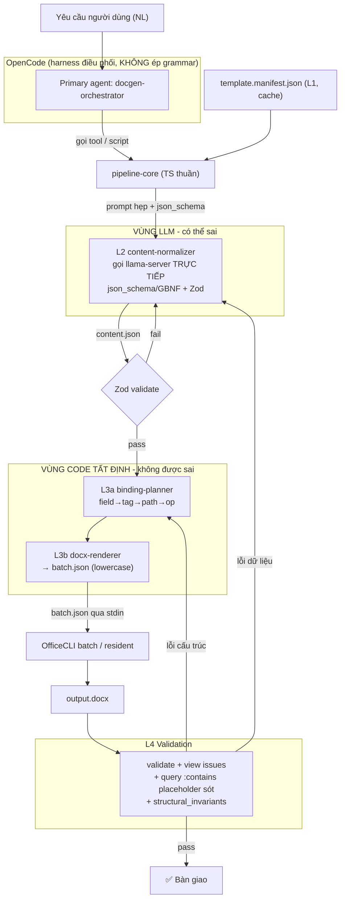

<aside>
🎯

**Core Philosophy:** The LLM only generates **schema-based data (JSON)**; all `.docx` operations are performed by **deterministic code** (deterministic compiler + OfficeCLI). This plan preserves your existing *Determinism Boundary* backbone, **revalidates it using the actual OfficeCLI source code (commit `5e51ae`, index 10/06/2026)**, and **fully integrates the OpenCode and Qwen3 serving components** that you currently lack.

</aside>

## 0. Prerequisite Reading: 4 Important Adjustments Compared to Your Analysis

Your analysis is about 90% correct. After directly comparing `SKILL.md`, the OfficeCLI wiki, and the OpenCode/llama.cpp documentation, there are **4 points that need to be corrected before coding** to avoid errors right from the ground up.

| # | Points in your version | Verified facts | Action |
| --- | --- | --- | --- |
| C1 | `batch.json` has uppercase field names: `{ "Command", "Path", "Props", "Index" }` | The OfficeCLI batch uses **lowercase** field **names**: `command` (or `op`), `path`, `parent`, `type`, `from`, `to`, `index`, `after`, `before`, `props`, `selector`, `mode`, `depth`, `part`, `xpath`, `action`, `xml` | **Change the BatchItem schema to lowercase.** This is an error that will cause a 100% failure if left as is. |
| C2 | `Set sdt[tag=agency_name]` directly | SKILL.md explicitly states: **“Bare unscoped selectors rejected on `set/remove`.”** Bare selectors without a path scope are rejected upon writing. | The Binding-planner **resolves `the tag` → specific path via `a query` first** (determined and cached in the manifest), then `sets it` based on the path. Do not `set it` directly using a bare selector. |
| C3 | GBNF uses the `--grammar` flag and “forces” the model in OpenCode | (a) llama-server accepts **`json_schema`** (completion) / **`response_format`** (chat) — the schema **MUST NOT be embedded in the prompt**; the model does not “see” it. (b) OpenCode calls the model via the OpenAI-compatible API and **does not** reliably **expose arbitrary grammar flags**. | **Separate L2 from the OpenCode chat loop**: run the normalizer as **a service that calls the llama-server directly** with`json_schema/grammar`. OpenCode acts as **a coordinating harness + host for MCP OfficeCLI**; it is not where the grammar is enforced. (Details in §8–§9.) |
| C4 | `Add `--index` ` to specify the insertion position | `--index` is **0-based** and is considered *legacy*. New recommended approach: **`--after <path>` / `--before <path>`** (1-based anchors per XPath). | The binding planner generates insertion operations using ``after` `/``before` ` based on anchors in the manifest; it does not use `indices`. |

<aside>
✅

The items in your version **are correct and should remain unchanged**: remove XML databinding (write directly to SDT), remove altChunk from the default path, prioritize ``add --from` clone-block` over the repeating-section SDT, treat the manifest as the sole source of truth, use two validation gates (``validate` ` + ``view issues``) plus `a `:contains` query` to catch missing placeholders, and use resident mode for multi-step operations.

</aside>

---

## 1. Verified OfficeCLI capabilities (foundation for design)

Excerpt from the actual `SKILL.md` file — only the sections directly relevant to the framework.

| Verb | Validation syntax | Used in the class |
| --- | --- | --- |
| `create` | `officecli create <file>` (file type inferred from the file extension) | — |
| `view` | `view <file> <mode>` — mode: `outline`, `stats`, `issues`, `text`, `annotated`, `html` | L1, L4 |
| `get` | `get <file> <path> --depth N [--json]` | L1 |
| `query` | `query <file> <selector>` — CSS-like selector: `[attr=value]` `[attr!=value]` `[attr~=text]` `:contains("...")` `:empty` `:has(formula)` `:no-alt`; boolean`and/or` | L1, L3a, L4 |
| `set` | `set <file> <path> --prop key=value [--prop ...]`; supports `find=/--replace`; **bare selectors are rejected — must be scoped** | L3b |
| `add` | `add <file> <parent> --type <type> [--after/--before <path>] [--prop ...]`; **`add <file> <parent> --from <path>`** = deep clone with cross-part relationships | L3b |
| `remove/move/swap` | Remove redundant placeholders; reorder nodes | L3b |
| `batch` | `batch <file> --input x.json` / `--commands '[...]'` / stdin; defaults to **continue-on-error** (exits with 1 if any item fails); `--stop-on-error`; `--force` bypass docx-protection | L3b |
| `dump` | `dump <file> [path]` → exports **a replayable JSON batch** (round-trip). Great for **regression testing**. | Test |
| `refresh` | Recalculate TOC / PAGE / cross-ref page numbers after replay (Word backend on Windows; headless-HTML fallback elsewhere) | L4 |
| `open/close` | Resident. **Automatically starts as a resident process on the first access (idle for 60 seconds)**; explicit`open/close` to maintain a long session (idle for 12 minutes). Disable: `OFFICECLI_NO_AUTO_RESIDENT=1` | L3b |
| `validate` | `validate <file>` → checks OOXML schema, returns issues in JSON | L4 |
| `raw/raw-set/add-part` | L3**escape-only** (XML-specific) | L3b (rare) |
| `mcp/load_skill/help` | MCP server (1 tool `command` • `load_skill` • `help`); `help <format>` & `load_skill <name>` ( `## Setup` stripped) — minimal context mechanism | §8 |

<aside>
📐

**Path conventions (verification):** **1-based** XPath-style paths (`/body/p[3]`, `/body/tbl[1]/tr[2]/tc[1]`, `/header[1]`, `/styles`, `/numbering`). `add --index` uses **0-based** (legacy). `sdt` is a valid type for `add`; SDT supports dropdown/combobox/locked + text replacement.

</aside>

---

## 2. Overall Architecture (revised + topology serving added)

The biggest difference from your diagram: **clarifying who calls the LLM, who enforces the grammar, and where OpenCode fits in.**



| Class | Responsibility | Definite? | Tool |
| --- | --- | --- | --- |
| **L1 Template Contract** | Scan template → generate `manifest` (run once per template, cached) | ✅ Code | `View outline`, `query`, `get` |
| **L2 Content Structuring** | NL → `content.json` with correct schema | ❌ LLM | llama-server (Qwen3-A3B) + GBNF/json_schema + Zod |
| **L3a Binding Planner** | manifest + content → op plan (field→tag→path→op) | ✅ Code | Pure TS (unit test) |
| **L3b Docx Renderer** | schedule → `batch.json` → apply patch | ✅ Code | TS + OfficeCLI `batch/resident` |
| **L4 Validation** | schema + missing placeholders + invariants | ✅ Code | `validate`, `view issues`, `query` |

---

## 3. Platform decision (finalize before coding)

<aside>
🧭

These are architectural decisions you haven’t made yet. I’ll provide recommendations and reasoning; please confirm so that I (or you) can proceed.

</aside>

### 3.1 Serving Qwen3-A3B: choose llama-server (recommended)

- **llama-server (llama.cpp)** — *recommended*. It’s **the only** option that supports`GBNF/json_schema` at the sampler level → ensuring strict adherence to the correct `content.json` structure. It’s OpenAI-compatible, so OpenCode can connect to it.
- Ollama: Convenient, but the`grammar/json_schema` transmission is unstable; not recommended for hard-coded L2.
- LM Studio: Good GUI for testing, but use the headless llama-server for production.

### 3.2 Grammar enforcement boundary: L2 calls llama-server DIRECTLY, not through the OpenCode chat

Reason explained in C3. Result: **Only `the `content-normalizer`` interacts with the LLM**, and it is **TypeScript code making an HTTP call** to `llama-server` with `a `json_schema``— **not** a chat subagent within OpenCode. OpenCode still has a *conceptual* ``content-normalizer`` subagent that you can call manually during debugging, but the production path goes through ``pipeline-core``.

### 3.3 OpenCode’s Role: harness + MCP host, not the product runtime

OpenCode is a **dev/agentic** environment where you issue commands to “generate a decision from this request”; it coordinates calls `to pipeline-core` and includes the OfficeCLI MCP for exploration (`help/query`). The actual product runtime is your **`office-auto` MCP server** (matching the project you’re migrating).

---

## 4. Full Repo Structure

```
office-auto/
├── opencode.json                 # cấu hình OpenCode: provider Qwen, MCP, agents
├── AGENTS.md                     # luật cứng cho agent (determinism boundary)
├── .opencode/
│   └── agents/
│       ├── docgen-orchestrator.md  # primary: điều phối pipeline
│       └── content-normalizer.md   # subagent (chỉ để debug tay)
├── .vscode/
│   └── mcp.json                  # MCP cho VS Code (officecli + office-auto)
├── package.json                  # Bun + @modelcontextprotocol/sdk + zod
├── tsconfig.json
├── src/
│   ├── pipeline-core.ts          # API thuần: runPipeline(req) -> result
│   ├── llm/
│   │   ├── client.ts             # gọi llama-server /completion + json_schema
│   │   └── normalizer.ts         # L2: NL -> content.json + Zod + self-repair
│   ├── manifest/
│   │   ├── schema.ts             # Zod cho manifest + content (schema-as-contract)
│   │   ├── auditor.ts            # L1: docx -> manifest (officecli view/query)
│   │   └── cache.ts
│   ├── render/
│   │   ├── binding-planner.ts    # L3a: manifest+content -> Op[]
│   │   ├── docx-renderer.ts      # L3b: Op[] -> batch.json (lowercase) -> officecli
│   │   └── officecli.ts          # wrapper spawn officecli (bash/MCP)
│   ├── validate/
│   │   └── validator.ts          # L4
│   └── mcp/
│       └── office-auto-server.ts # MCP server expose: generate_document, audit_template
├── templates/                    # *.docx mẫu
├── manifests/                    # *.manifest.json (cache L1)
├── grammars/                     # *.gbnf sinh từ json_schema (tùy chọn)
├── out/                          # output.docx + batch.json log
└── test/
    ├── golden/                   # batch.json + docx vàng cho regression
    └── *.test.ts
```

---

## 5. L1 — Template Contract & Manifest

### 5.1 Two template modes

| Mode | Anchoring Mechanism | OfficeCLI command | When using |
| --- | --- | --- | --- |
| `strict-sdt` | SDT with standard `tags`  | `query sdt[tag=...]` → resolve path → `set <path>` | New template, controlled editing |
| `legacy-anchor` | Placeholder text / bookmark | `set <scoped-path> --find "agency_name" --replace ...` | Old administrative template |

### 5.2 `manifest` = the single source of truth

Maintain the structure you proposed, **adding two fields** to define C2 and C4:

- `resolved_path` for each field (pre-resolved by the auditor from `tag` → path, so L3b doesn’t have to query during rendering).
- Use ` `after``/``before` ` instead of ` `index`` for the repeater’s`anchor`.

```json
{
  "template_id": "quyet-dinh-001",
  "mode": "strict-sdt",
  "locale": "vi-VN",
  "fields": {
    "agency_name":     { "sdt_tag": "agency_name", "resolved_path": "/body/sdt[1]", "type": "scalar", "max_len": 120 },
    "document_number": { "sdt_tag": "doc_no", "resolved_path": "/body/sdt[2]", "type": "scalar", "pattern": "^[0-9]+/[A-ZĐ-]+$" },
    "issue_date":      { "sdt_tag": "issue_date", "resolved_path": "/body/sdt[3]", "type": "date" },
    "signer_name":     { "sdt_tag": "signer_name", "resolved_path": "/body/sdt[4]", "type": "scalar" }
  },
  "repeaters": {
    "decision_items": {
      "clone_from": "/body/p[@style='DieuKhoan'][1]",
      "insert_anchor": { "mode": "after", "path": "/body/p[@style='DieuKhoan'][last()]" },
      "item_fields": { "title": "run[1]", "content": "run[2]" }
    }
  },
  "tables": {
    "appendix_table": { "path": "/body/tbl[1]", "header_rows": 1, "columns": ["stt", "name"] }
  },
  "structural_invariants": {
    "required_sections": ["QUOC_HIEU", "TIEU_NGU", "signature_block"],
    "page_numbering": true
  }
}
```

### 5.3 Auditor (L1) — outline

```tsx
// src/manifest/auditor.ts — chạy offline 1 lần / template
export async function auditTemplate(docxPath: string): Promise<Manifest> {
  const outline = await officecli(["view", docxPath, "outline", "--json"])
  const sdts    = await officecli(["query", docxPath, "sdt", "--json"]) // liệt kê mọi SDT
  const fields: Record<string, FieldSpec> = {}
  for (const sdt of sdts) {
    // resolve tag -> path NGAY tại đây (C2): cache resolved_path
    fields[sdt.tag] = { sdt_tag: sdt.tag, resolved_path: sdt.path, type: inferType(sdt) }
  }
  // dò repeaters bằng query theo style; dò bảng bằng query tbl; ...
  const manifest = ManifestSchema.parse({ /* ... */ })
  return manifest
}
```

<aside>
🔎

**Field verification is needed (run once in production):** check if the JSON output of `the sdt query` returns both `the tag` and `path` simultaneously, and verify the syntax of the predicate `[@style='...']` in`the query/add --from` command. Use ` `officecli help docx query` ` and ``officecli help docx add``. If `the query` does not return a path, fallback to ` `get / --depth N --json` ` and then manually traverse the tree to find the sdt by tag.

</aside>

---

## 6. L2 — Content schema & constrained generation (LLM-specific area)

### 6.1 schema-as-contract (Zod → JSON Schema → GBNF)

```tsx
// src/manifest/schema.ts
import { z } from "zod"

export const ContentSchema = z.object({
  template_id: z.literal("quyet-dinh-001"),
  locale: z.literal("vi-VN"),
  fields: z.object({
    agency_name: z.string().max(120),
    document_number: z.string().regex(/^[0-9]+\/[A-ZĐ-]+$/),
    issue_date: z.string().regex(/^\d{4}-\d{2}-\d{2}$/),
    signer_name: z.string(),
    signer_title: z.string(),
  }),
  blocks: z.object({
    legal_basis: z.array(z.string()).min(1),
    decision_items: z.array(z.object({ title: z.string(), content: z.string() })).min(1),
  }),
  tables: z.object({
    appendix_table: z.array(z.object({ stt: z.number().int(), name: z.string() })),
  }).partial(),
})
export type Content = z.infer<typeof ContentSchema>
```

Generate a JSON Schema from Zod (Zod v4 includes ``z.toJSONSchema``), then load it into llama-server as ` `json_schema``.

### 6.2 Call llama-server with a hard-coded structure

```tsx
// src/llm/client.ts
export async function generateJSON(prompt: string, jsonSchema: object): Promise<unknown> {
  const res = await fetch("http://127.0.0.1:8080/completion", {
    method: "POST",
    headers: { "Content-Type": "application/json" },
    body: JSON.stringify({
      prompt,
      json_schema: jsonSchema,   // <- ép cứng ở sampler (KHÔNG nhúng vào prompt)
      temperature: 0.2,
      n_predict: 1024,
      cache_prompt: true,
    }),
  })
  const data = await res.json()
  return JSON.parse(data.content)
}
```

<aside>
⚠️

**Caveat regarding GBNF JSON (verified by the llama.cpp community):** since `the JSON Schema` is **not** embedded in the prompt, the model does not “know” the structure → **you still need to describe the schema in words within the prompt** so the model can populate *the* correct *semantics* (syntax correctness is handled by the grammar). Additionally, some automatically generated JSON grammars **do not blacklist `\`r/`\n`** within strings → check the grammar and escaping carefully.

</aside>

### 6.3 Narrow self-repair loop

```tsx
// src/llm/normalizer.ts — L2
export async function normalize(req: UserRequest, manifest: Manifest): Promise<Content> {
  const jsonSchema = toJSONSchema(ContentSchema)
  const prompt = buildPrompt(req, manifest.fields) // chỉ fields+blocks (tên+kiểu), KHÔNG path/XML
  for (let attempt = 0; attempt < 3; attempt++) {
    const raw = await generateJSON(prompt, jsonSchema)
    const parsed = ContentSchema.safeParse(raw)
    if (parsed.success) return parsed.data
    // self-repair HẸP: chỉ gửi lại field sai + thông báo lỗi Zod, không sinh lại cả file
    prompt = appendRepairHint(prompt, parsed.error)
  }
  throw new ContentValidationError()
}
```

<aside>
🧠

**Principle for A3B:** each call = **one narrow task, one small schema**. Separate “summary + legal basis” from “clause content” if the form has > ~20–40 fields. The narrower the task, the more reliable the 3B-active model.

</aside>

---

## 7. L3 — Binding Planner + Docx Renderer

### 7.1 Three-level rendering strategy (C1/C2/C4 revised)

| Level | Revision | Op OfficeCLI |
| --- | --- | --- |
| 1. Scalar | Write the SDT directly to **the resolved path** (or use find/replace for legacy files) | `set <resolved_path> --prop text=...` |
| 2. Structured block | **Clone a block as needed** • add paragraph/table; insert using`after/before` | `add <parent> --from <template> --after <anchor>`, `add --type table`, `set` cells |
| 3. Workaround | `raw/raw-set/add-part` for OOXML-specific cases (NO default altChunk) | `raw`, `raw-set`, `add-part` |

### 7.2 Binding-planner (L3a, pure code)

```tsx
// src/render/binding-planner.ts
export type Op =
  | { kind: "set"; path: string; props: Record<string, string> }
  | { kind: "clone"; parent: string; from: string; after?: string; before?: string }
  | { kind: "setCell"; path: string; props: Record<string, string> }

export function plan(content: Content, manifest: Manifest): Op[] {
  const ops: Op[] = []
  // 1) scalar fields -> set theo resolved_path (C2)
  for (const [name, val] of Object.entries(content.fields)) {
    const f = manifest.fields[name]
    ops.push({ kind: "set", path: f.resolved_path, props: { text: String(val) } })
  }
  // 2) repeaters -> clone-block, chèn after anchor (C4)
  const r = manifest.repeaters.decision_items
  content.blocks.decision_items.forEach((item, i) => {
    ops.push({ kind: "clone", parent: "/body", from: r.clone_from,
               after: r.insert_anchor.path })
    // sau clone: set run con theo item_fields (title/content)
  })
  // 3) tables -> add tr + set tc ...
  return ops
}
```

<aside>
⚙️

**Note on multiple clones:** when cloning repeatedly, the `"after"` anchor shifts after each insertion. Two possible approaches: (a) always insert `after` the newly cloned node (tracking the new path), or (b) clone in **reverse** order and always `use` the same original `"after"` anchor. Choose (a), and **log to batch.json** for diffing.

</aside>

### 7.3 Docx-renderer (L3b) — compiles to CORRECT `batch.json` (lowercase)

```tsx
// src/render/docx-renderer.ts
function toBatch(ops: Op[]): object[] {
  return ops.map((op) => {
    switch (op.kind) {
      case "set":     return { command: "set", path: op.path, props: op.props }
      case "clone":   return { command: "add", parent: op.parent, from: op.from,
                               ...(op.after ? { after: op.after } : {}),
                               ...(op.before ? { before: op.before } : {}) }
      case "setCell": return { command: "set", path: op.path, props: op.props }
    }
  })
}

export async function render(ops: Op[], file: string) {
  const batch = toBatch(ops)
  await Bun.write("out/batch.json", JSON.stringify(batch, null, 2)) // log để audit/regression
  // resident cho multi-step: open -> batch -> close
  await officecli(["open", file])
  await officecliStdin(["batch", file, "--input", "out/batch.json", "--stop-on-error", "--json"], batch)
  await officecli(["close", file])
}
```

Example of `a` properly formatted `batch.json` (lowercase, using " `after"`):

```json
[
  { "command": "set", "path": "/body/sdt[1]", "props": { "text": "UBND Quận X" } },
  { "command": "set", "path": "/body/sdt[2]", "props": { "text": "12/QĐ-UBND" } },
  { "command": "add", "parent": "/body", "type": "paragraph", "after": "/body/p[3]", "props": { "style": "CanCu", "text": "Căn cứ Luật..." } },
  { "command": "add", "parent": "/body", "from": "/body/p[@style='DieuKhoan'][1]", "after": "/body/p[@style='DieuKhoan'][last()]" },
  { "command": "set", "path": "/body/tbl[1]/tr[2]/tc[1]", "props": { "text": "1" } }
]
```

<aside>
❗

**Need to verify:** the `text` key for SDT (`text` vs. `value`) and for cells — run ``officecli help docx set` ` and ` `officecli help docx sdt``. Also confirm that `the batch` accepts ``after`/`from` ` in an item (SKILL.md lists the ``from` ``/`after`` /``before`` fields for the batch — likely OK, but still test one item).

</aside>

---

## 8. L4 — Validation

```tsx
// src/validate/validator.ts
export async function validate(file: string, manifest: Manifest) {
  const schema = await officecli(["validate", file, "--json"])            // cổng cứng OOXML
  const issues = await officecli(["view", file, "issues", "--json"])      // heuristic
  const leftover = await officecli(["query", file, ":contains(\"{{\")"]) // placeholder sót
  const invariants = checkInvariants(file, manifest.structural_invariants)
  // nếu có field code (TOC/PAGE) cần số trang đúng -> officecli refresh
  return { ok: schema.ok && issues.length === 0 && leftover.length === 0 && invariants.ok,
           schema, issues, leftover, invariants }
}
```

Error path: **structural** error → go back to L3a (do not call LLM); **data** error → one narrow self-repair loop at L2.

---

## 9. Serving Qwen3-A3B + GBNF (llama.cpp) — specific configuration

### 9.1 Launching llama-server

```bash
# Qwen3 30B/35B-A3B GGUF, ép JSON ở cấp sampler, bật prompt cache
llama-server \
  -m ./models/Qwen3-30B-A3B-Q4_K_M.gguf \
  --host 127.0.0.1 --port 8080 \
  -c 16384 \          # context: đủ cho manifest.fields + prompt; KHÔNG cần 256k
  -ngl 99 \           # offload tối đa lên GPU (tùy VRAM)
  --jinja \           # template chat đúng của Qwen3
  --temp 0.2
```

- Pass `the json_schema` **in the request body** (as in §6.2) — no need for the CLI grammar flag.
- Alternatively, generate the `.gbnf` file using `examples/json_schema_to_grammar.py` and pass `the grammar`.
- **Context budget:** a typical L2 prompt ≈ a few thousand tokens (request + `manifest.fields` + schema description). Path/OOXML **never** enters the context (they reside in the code area).

### 9.2 Minimize the context using the OfficeCLI mechanism itself

| Mechanism | Used for |
| --- | --- |
| `help docx` / `help docx <element>` | The agent looks up the **correct** prop/enum/unit name **when needed**, without having to remember it |
| `load_skill docx` | Load the scene guide on demand (with `## Setup` removed), < 5k tokens |
| `officecli mcp` | Make OfficeCLI a robust tool (single-parameter `command`) — no CLI description tokens required |

---

## 10. Complete OpenCode configuration (the parts you don’t have yet)

<aside>
📌

Order of loading OpenCode config by proximity: **project-local `.opencode/` → parent directory → global `~/.config/opencode/.`** For project-specific config, place everything in `the office-auto/` repo `.`

</aside>

### 10.1 `opencode.json`

```json
{
  "$schema": "https://opencode.ai/config.json",

  // 1) Provider: trỏ tới llama-server local (OpenAI-compatible)
  "provider": {
    "llamacpp": {
      "npm": "@ai-sdk/openai-compatible",
      "name": "llama.cpp (local Qwen3-A3B)",
      "options": { "baseURL": "http://127.0.0.1:8080/v1" },
      "models": { "qwen3-a3b": { "name": "Qwen3-30B-A3B" } }
    }
  },

  // 2) MCP: OfficeCLI (khám phá help/skill/query) + office-auto (runtime sản phẩm)
  "mcp": {
    "officecli": {
      "type": "local",
      "command": ["officecli", "mcp"],
      "enabled": true,
      "environment": { "OFFICECLI_NO_AUTO_RESIDENT": "0" }
    },
    "office-auto": {
      "type": "local",
      "command": ["bun", "run", "src/mcp/office-auto-server.ts"],
      "enabled": true,
      "environment": { "LLAMA_BASE_URL": "http://127.0.0.1:8080" }
    }
  },

  // 3) Tắt MCP nặng toàn cục, chỉ bật theo agent (tiết kiệm context)
  "tools": { "officecli*": false },

  // 4) Agents
  "agent": {
    "docgen-orchestrator": {
      "mode": "primary",
      "model": "llamacpp/qwen3-a3b",
      "prompt": "{file:./.opencode/prompts/orchestrator.txt}",
      "tools": { "office-auto*": true, "officecli*": true },
      "permission": { "edit": "allow", "bash": "allow" }
    },
    "content-normalizer": {
      "mode": "subagent",
      "model": "llamacpp/qwen3-a3b",
      "description": "Debug tay: NL -> content.json. Production đi qua pipeline-core.",
      "temperature": 0.2,
      "prompt": "{file:./.opencode/prompts/normalizer.txt}",
      "permission": { "edit": "deny", "bash": "deny" }
    }
  },
  "default_agent": "docgen-orchestrator"
}
```

<aside>
ℹ️

The `provider` block uses OpenCode’s OpenAI-compatible mechanism to point to the llama-server. If your version of OpenCode declares a slightly different provider, keep the same concept: `baseURL` = `http://127.0.0.1:8080/v1`, optional model ID. This is a point worth **quickly verifying** with the current version `of OpenCode`.

</aside>

### 10.2 `AGENTS.md` (hard rules — preventing LLMs from circumventing boundaries)

```markdown
# office-auto — Quy tắc cho agent

## Determinism Boundary (BẮT BUỘC)
- TUYỆT ĐỐI KHÔNG tự sinh: OOXML, đường path (`/body/p[3]`), hay `batch.json`.
- Khi cần tạo/sửa .docx: LUÔN gọi tool `office-auto_generate_document` (đi qua pipeline-core).
- LLM chỉ được sinh `content.json` đúng schema; mọi ánh xạ field→path là code.

## Khám phá tài liệu docx
- Cần biết prop/enum: dùng `officecli` MCP `help docx <element>` hoặc `load_skill docx`.
- KHÔNG nạp XML thô template vào context. Chỉ đọc `manifest.fields`.

## Render
- Luôn dùng `batch` (1 open/save), field chữ thường, log `out/batch.json`.
- Sau render: chạy validate + view issues + query placeholder sót.

## Setup
- Chạy llama-server trước (port 8080). Cài: `bun install`.
```

### 10.3 `.opencode/agents/content-normalizer.md` (Markdown agent — manual debugging)

```markdown
---
description: NL -> content.json đúng schema (chỉ debug; production qua pipeline-core)
mode: subagent
model: llamacpp/qwen3-a3b
temperature: 0.2
permission:
  edit: deny
  bash: deny
---
Bạn là content-normalizer. Nhiệm vụ DUY NHẤT: chuyển yêu cầu NL thành `content.json`
đúng schema được cung cấp. KHÔNG sinh path, OOXML, hay lệnh officecli.
Chỉ điền dữ liệu ngữ nghĩa (đúng cú pháp do grammar đảm bảo).
Nếu thiếu thông tin: để trống field optional, KHÔNG bịa số quyết định/ngày.
```

### 10.4 `.vscode/mcp.json` (configure your VS Code/OpenCode environment)

```json
{
  "servers": {
    "officecli":   { "command": "officecli", "args": ["mcp"] },
    "office-auto": { "command": "bun", "args": ["run", "src/mcp/office-auto-server.ts"] }
  }
}
```

### 10.5 `office-auto` MCP server (product runtime)

```tsx
// src/mcp/office-auto-server.ts (Bun + @modelcontextprotocol/sdk + zod)
import { McpServer } from "@modelcontextprotocol/sdk/server/mcp.js"
import { z } from "zod"
import { runPipeline } from "../pipeline-core"

const server = new McpServer({ name: "office-auto", version: "0.1.0" })

server.tool("generate_document",
  { template_id: z.string(), request: z.string() },
  async ({ template_id, request }) => {
    const r = await runPipeline({ templateId: template_id, request })
    return { content: [{ type: "text", text: JSON.stringify(r) }] }
  })

server.tool("audit_template",
  { docx_path: z.string() },
  async ({ docx_path }) => { /* gọi auditTemplate -> cache manifest */ })
```

---

## 11. End-to-end orchestration (single run of “Administrative Decision”)

1. **(L1, offline, cache)** `audit_template(quyet-dinh.docx)` → `manifests/quyet-dinh-001.manifest.json` (pre-resolved `resolved_path` for all SDTs).
2. **(L2, LLM)** `pipeline-core` calls llama-server with prompt = request + `manifest.fields` + `json_schema` → `content.json`; Zod validation (≤3 rounds of narrow self-repair).
3. **(L3a, code)** `binding-planner` → `Op[]` (scalar → set based on resolved_path; repeater → clone `--from ... --after ...`; table → add tr + set tc).
4. **(L3b, code)** `docx-renderer` → `out/batch.json` (lowercase) → `officecli open` → `batch --input ... --stop-on-error` → `close`.
5. **(L4, code)** `validate` + `view issues` + `query :contains("")` + invariants; if TOC/PAGE exists → `refresh`. Structural error → L3a; data error → L2.

---

## 12. Testing & Regression

- **Unit tests (Bun) for specific code areas:** `binding-planner` (content+manifest → expected Op[]) and `docx-renderer` (Op[] → byte-exact batch.json). This is where "consistency enforcement" is verified.
- **Golden batch.json:** save `test/golden/*.batch.json`; any changes to the planner must pass a clean diff.
- **Round-trip with `dump`:** `officecli dump output.docx` → compare against the expected batch to catch drift.
- **Snapshot validation:** Run `validate` and `review issues` on the golden output; fail if new issues arise.
- **L2 evaluation (soft):** a set of ~20 natural language requests → check the Zod pass rate in the first round (measuring the reliability of Qwen-A3B + prompt).

---

## 13. Phase-based deployment roadmap

| Phase | Objectives | Deliverable | Completion Criteria |
| --- | --- | --- | --- |
| **P0 — Verification Spike** | Demystifying the 5 OfficeCLI Mysteries (§5.3, §7.3, §10.1) | 1 Bash script to test `SDT queries`, `set` SDT, `add --from and --after` parameters, run `in batch mode`, and `validate` on a sample .docx file | Understand key text sets, predicate syntax, and batch fields |
| **P1 — Serving + Skeleton** | llama-server is running; skeleton repo + Zod schema | llama-server :8080, `pipeline-core` stub, `ContentSchema` | `generateJSON` returns JSON that passes through Zod for a sample prompt |
| **P2 — L1 auditor** | docx → manifest (resolve path) | `auditor.ts` • `manifests/*.json` | Manifest 1 real template—parse with Zod OK |
| **P3 — L3 render (core component)** | manifest+content → docx (no LLM needed yet; use manually written content.json) | `binding-planner` • `docx-renderer` • golden tests | Generates the correct .docx from the sample content.json, passes all validations |
| **P4 — L2 normalizer** | Integrate LLM + GBNF + self-repair | `normalizer.ts` | ≥80% of NL requests pass Zod in ≤2 rounds |
| **P5 — L4 + e2e** | Full validation + loopback error path | `validator.ts`, `runPipeline` | 1 natural language command → end-to-end valid output.docx |
| **P6 — OpenCode + MCP** | Packaged as office-auto MCP + OpenCode configuration | `opencode.json`, `AGENTS.md`, `office-auto-server.ts` | Call `generate_document` from OpenCode to run |
| **P7 — legacy-anchor + multiple templates** | Extend the `legacy-anchor` mode, add text types | Official letter/memorandum templates… | ≥3 types of administrative documents run smoothly |

---

## 14. Architecture Decision Log

| # | Decision | Reason |
| --- | --- | --- |
| D1 | LLM only generates `content.json`; the code generates `batch.json` | A3B 3B-active is not reliable for path/OOXML |
| D2 | Write SDT directly to the resolved path, omitting XML data binding | OfficeCLI lacks verb binding; headless-friendly |
| D3 | Remove altChunk/HTML from the default path | OfficeCLI does not import HTML; raw is only for fallback |
| D4 | Clone-block (`add --from --after`) replaces repeating-section SDT | Definite, not dependent on Word version |
| D5 | Manifest = the single source of truth (including `resolved_path`) | Keep XML/path out of the LLM context; avoid queries during rendering |
| D6 | **L2 calls llama-server directly with `json_schema`**; does not enforce grammar in OpenCode | OpenCode does not expose trusted grammar; only llama-server can hardcode it |
| D7 | OpenCode = harness + MCP host; actual runtime = office-auto MCP | Separate the dev environment from the production environment |
| D8 | Use **lowercase** for BatchItem; use " `after`" or "`before` " instead of `an index` | Ensure the batch format matches what OfficeCLI has verified |

---

## 15. Risks & points to verify in the field

<aside>
🚧

Run ` `officecli help docx <verb>` ` to confirm — faster than reading the source code:

</aside>

- **Key set text for SDT/cell** (`text` vs. `value`): `officecli help docx set`, `help docx sdt`.
- **Predicate `[@style='...']`** in `query` and `add --from`: `officecli help docx add`, `help docx query`.
- **Batch accepts**  "**`from`"/"`after`** " in items: test a single item clone before building the planner.
- Does**the `sdt --json query`output**  include `a path` (if not → fallback to traversing the tree from `get / --depth N`)?
- **The**  `**llama-server` provider in**  `**`opencode.json`**`: verify the provider syntax against the current OpenCode version.
- **Qwen3-A3B + Vietnamese JSON Schema regex** (character `Đ`, diacritics): test whether `the document_number` regex in the grammar correctly handles Unicode; ensure the JSON grammar does not blacklist `\r\n`.
- **Cross-platform`refresh`**: On Linux, use headless-HTML as a fallback for TOC/PAGE — verify page number accuracy if the text requires a TOC.

---

## 16. Summary of Recommendations

1. **Keep** your backbone: 4 layers, Determinism Boundary, 2-mode template, manifest-as-contract.
2. **Fix 4 foundational bugs** before coding: batch lowercase (C1), resolve SDT path before setting (C2), L2 enforce grammar outside OpenCode (C3), use`after/before` instead of `index` (C4).
3. **Serving:** llama-server + `json_schema`; OpenCode is just a harness + MCP host; the runtime is office-auto MCP.
4. **Start with P0** (spike verifying 5 hidden variables) then P3 (deterministic rendering core) — this is the real “consistency enforcement” part; build and test before the LLM.

<aside>
🔗

Cross-referenced sources: OfficeCLI SKILL.md & wiki (DeepWiki/GitHub, commit `5e51ae`), OpenCode documentation (config/agents/mcp-servers), and the llama.cpp GBNF guide. Any items marked with 🚧/❗ are points you should `help verify` when you start coding.

https://deepwiki.com/iOfficeAI/OfficeCLI

https://github.com/iOfficeAI/OfficeCLI
</aside>